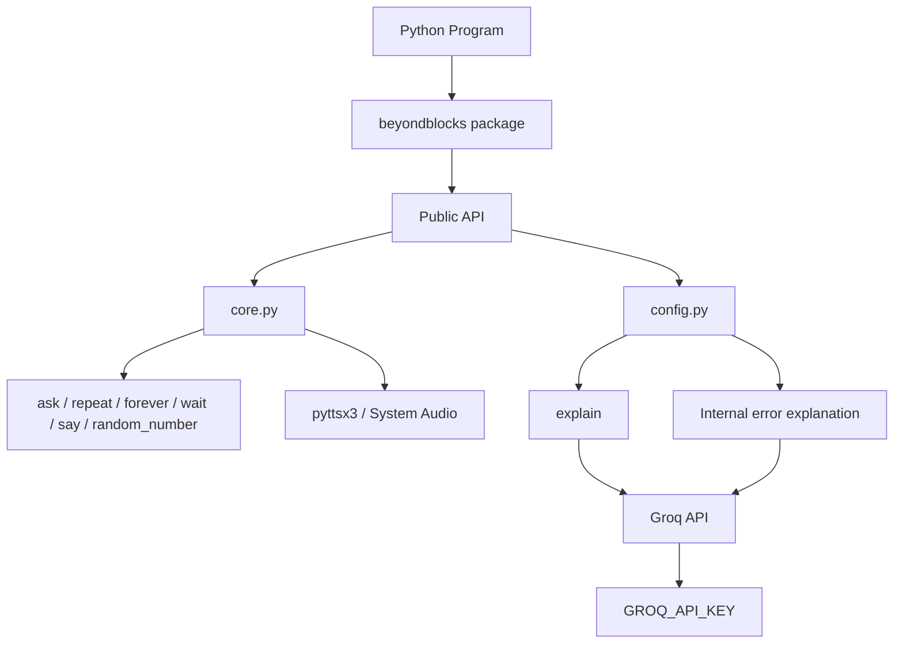

# Beyond Blocks

A beginner-friendly Python library for helping learners move from block-based programming to Python.

Beyond Blocks keeps the learner in **real Python** while providing simple functions for concepts commonly introduced through block-based programming.

It also includes two AI-powered features:

- `explain()` for beginner-friendly code explanations
- automatic explanation of uncaught runtime errors

---

## Start Here

Use this README to answer the first questions:

- **What is Beyond Blocks?** → Read the short overview below.
- **How do I run it?** → Go to [How to Run](#how-to-run).
- **What does each function do?** → See [Functions](#functions).
- **How are the AI features configured?** → See [AI Features](#ai-features).
- **How do I use it in real programs?** → See `examples/`.
- **How does something work internally?** → See `docs/` and the source.
- **How was it tested?** → See `tests/`.

The README gives the essentials. The detailed documentation contains the full reference.

---

## What is Beyond Blocks?

Moving from Scratch or another block-based programming environment to Python can be difficult because the learner already understands programming ideas, but now also has to learn Python syntax.

Beyond Blocks provides small Python functions that make some of those familiar ideas easier to express.

For example:

```python
repeat(3, say, "Hello!")
```

is ordinary Python, but it resembles the idea of a `repeat` block.

The library is meant to be a **bridge**, not a replacement for Python.

---

# How to Run

## GitHub Codespaces — Recommended

The repository includes a preconfigured development container.

### 1. Open the repository

Open the GitHub repository and select:

**Code → Codespaces → Create codespace on `main`**

### 2. Let the environment finish building

The Codespace installs the project and its required dependencies automatically.

### 3. Create a Python file

For example:

```text
main.py
```

### 4. Import Beyond Blocks

```python
from beyondblocks import ask, say, random_number

name = ask("What is your name?")
print(f"Hello, {name}!")

number = random_number(1, 10)
print("Random number:", number)
```

### 5. Run it

```bash
python main.py
```

The Codespace is the easiest way to reproduce the project's development environment.

> **Note:** `say()` uses text-to-speech and depends on the system audio environment. A remote Codespace may not have an audio output device, so `say()` may not produce audible output there.

---

## Local Installation

From the project root:

```bash
python -m pip install -e .
```

Then create a Python file and use the package normally:

```python
from beyondblocks import repeat, say

def greet():
    say("Hello!")

repeat(3, greet)
```

Run it with:

```bash
python main.py
```

The project can also be run from a downloaded copy of the repository after its dependencies are installed.

---

# Functions

| Function | Syntax | Purpose |
|---|---|---|
| `ask()` | `ask(question)` | Gets user input. Whole numbers become `int`, decimal numbers become `float`, and other input remains `str`. |
| `repeat()` | `repeat(times, action, *args, **kwargs)` | Runs a function a specified number of times. |
| `forever()` | `forever(action, *args, **kwargs)` | Runs a function continuously until the program is stopped. |
| `wait()` | `wait(seconds)` | Pauses execution for the specified number of seconds. |
| `say()` | `say(text)` | **Text-to-speech**: speaks the supplied text aloud. It is not a replacement for `print()`. |
| `random_number()` | `random_number(start, end)` | Returns a random whole number between `start` and `end`, inclusive. |
| `explain()` | `explain(code_block)` | Uses AI to explain Python code in beginner-friendly language. |

### Quick examples

```python
name = ask("What is your name?")
```

```python
repeat(3, print, "Hello!")
```

```python
wait(2)
```

```python
say("Hello, world!")
```

```python
number = random_number(1, 10)
```

```python
print(explain("x = random_number(1, 10)"))
```

A negative integer passed to `repeat()` raises `ValueError`.

---

# Why These Functions?

Beyond Blocks does **not** try to replace every Python function.

Some Python functionality is already simple enough for beginners.

For example:

```python
print("Hello!")
```

already works well, so there is no need for a Beyond Blocks wrapper just to replace `print()`.

Other concepts benefit from a simpler interface or provide functionality Python does not provide directly.

For example:

- `ask()` simplifies input and common type conversion.
- `repeat()` and `forever()` provide familiar block-style entry points.
- `random_number()` mirrors a common block-based idea.
- `say()` adds text-to-speech rather than terminal output.
- `explain()` adds AI-powered code explanation.

The aim is to reduce the initial friction without removing Python itself.

---

# AI Features

Beyond Blocks uses the **Groq API** for its AI functionality.

### `explain()`

Explains supplied Python code in simple language.

```python
from beyondblocks import explain

print(explain("x = random_number(1, 10)"))
```

### Automatic error explanation

Beyond Blocks can also explain an **uncaught runtime error** in beginner-friendly language.

The internal `handle_error()` function is used automatically and is **not part of the public API**.

### API key

AI features require:

```text
GROQ_API_KEY
```

Provide it through your environment.

For local development, a `.env` file can be used:

```text
GROQ_API_KEY=your_api_key_here
```

Keep `.env` out of Git.

A configured GitHub Codespace can provide the key through a Codespaces secret.

The normal non-AI functions do not require a Groq API key.

---

# Block-Based Concepts

| Block-based concept | Beyond Blocks |
|---|---|
| Ask and Wait | `ask()` |
| Repeat | `repeat()` |
| Forever | `forever()` |
| Wait | `wait()` |
| Say | `say()` |
| Pick Random | `random_number()` |

These are conceptual mappings. Beyond Blocks is still normal Python.

---

# Architecture



At a high level:

- `__init__.py` exposes the public API.
- `core.py` contains the main non-AI functions.
- `config.py` contains the AI features and internal error handling.
- AI features communicate with Groq.
- `say()` depends on the system's text-to-speech/audio environment.

For deeper architectural details, see `docs/`.

---

# Project Structure

```text
beyondblocks/
├── __init__.py
├── core.py
└── config.py

tests/
├── v1/
├── v2/

examples/
docs/
.devcontainer/
pyproject.toml
```

### Where to go next

**Want to learn how to use Beyond Blocks?**  
→ `examples/`

**Want the detailed function/API reference?**  
→ `docs/`

**Want to see how the project is tested?**  
→ `tests/`

**Want to see the implementation?**  
→ `beyondblocks/`

**Want to understand the development environment?**  
→ `.devcontainer/`

---

# Testing

The project was tested in multiple stages:

- **V1:** normal function-level behavior
- **V2:** edge cases, unusual inputs, parameters, and attempts to break assumptions
- **Environment testing:** local machine, downloaded ZIP copy, and a fresh GitHub Codespace
- **AI testing:** `explain()` was tested through the configured Codespace environment

Integration testing is intentionally lightweight in the current version; the main testing effort was focused on the individual functions and validating the package in real environments.

For the detailed test suite, see `tests/`.

---

# Known Limitations

- AI features require a Groq API key and network access.
- AI-generated explanations can occasionally be imperfect.
- `say()` depends on the operating system's text-to-speech/audio environment.
- A remote Codespace may not have an audio output device.
- The API is intentionally small and focused on the block-to-Python transition.

---

# References

- [Scratch](https://scratch.mit.edu/)
- [Python Documentation](https://docs.python.org/3/)
- [Groq Documentation](https://console.groq.com/docs)
- [pyttsx3 on PyPI](https://pypi.org/project/pyttsx3/)
- [python-dotenv on PyPI](https://pypi.org/project/python-dotenv/)
- [GitHub Codespaces Documentation](https://docs.github.com/en/codespaces)

