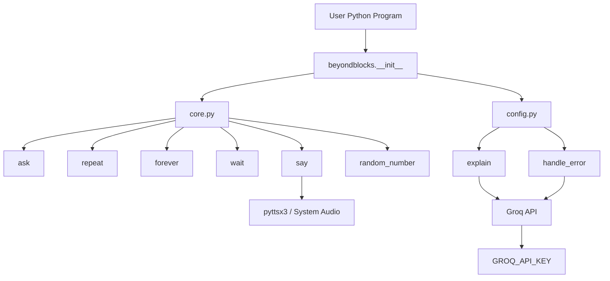

# Architecture

Beyond Blocks is intentionally small. It separates the public API, core functions, and AI/configuration logic without adding unnecessary layers.

## High-level architecture



## `__init__.py`

The package entry point.

It re-exports:

```text
ask
repeat
forever
wait
say
random_number
explain
```

so users can write:

```python
from beyondblocks import ask, repeat, say
```

without depending on internal filenames.

`handle_error()` is intentionally not exported.

## `core.py`

Contains:

```text
ask()
repeat()
forever()
wait()
say()
random_number()
```

It also installs the custom exception hook used by automatic runtime-error explanation.

## `config.py`

Contains:

```text
explain()
handle_error()
```

plus the Groq configuration and prompts.

The AI client is created when an AI feature needs it rather than requiring an API key for every package import.

## Import flow

```text
from beyondblocks import ask
        |
        v
__init__.py
        |
        v
core.py
        |
        v
ask()
```

For AI:

```text
from beyondblocks import explain
        |
        v
__init__.py
        |
        v
config.py
        |
        v
Groq API
```

## Configuration flow

```text
GROQ_API_KEY
      |
      v
AI configuration
      |
      v
Groq client
      |
      +--> explain()
      |
      +--> handle_error()
```

The API credential is supplied by the environment rather than stored in package source.

## Codespaces

The repository contains:

```text
.devcontainer/
└── devcontainer.json
```

The development container provides the Python environment, installs system dependencies required by the TTS stack, and installs the project.

A Codespace can additionally receive `GROQ_API_KEY` through a secure environment secret.

## Audio path

```text
say("Hello")
    |
    v
pyttsx3
    |
    v
Operating-system TTS/audio
```

This is why `say()` is more environment-dependent than the other core functions.
